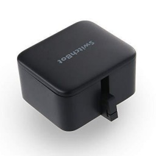

# Switchbot (BLE) adapter for ioBroker

This adapter allows you to control your SwitchBot "Bot" and to monitor the temperature/humidity from SwitchBot "Meter".

## Before you install

* This adapter doesn't support Hub Plus/Mini
* It only supports "SwitchBot Bot" and "SwitchBot Meter" over Bluetooth (BLE)
* Controlling "SwitchBot Bot" isn't 100% stable yet (see known issues)

## Dependencies

* [Node.js](https://nodejs.org/en/) 10 +
* [switchbot](https://github.com/ukiuni/Switchbot) for moving the arm from SwitchBot "Bot"
* [node-switchbot](https://github.com/futomi/node-switchbot) for monitoring the states of your SwitchBot "Bot" and "Meter"

## Supported OS

[node-switchbot](https://github.com/futomi/node-switchbot) currently supports only Linux-based OSes, such as Raspbian, Ubuntu, and so on.

## Installation

It is recommended to use version 12.x or 14.x of Node.js.

The minimum required version is still 10.x, **but that will change soon**.

Before installing the adapter, some linux libraries related Bluetooth as follows if the OS is Ubuntu/Debian/Raspbian.

```
$ sudo apt-get install bluetooth bluez libbluetooth-dev libudev-dev
```

See the documentation of [@abandonware/noble](https://github.com/abandonware/noble#readme) for other operating systems details.

If the adapter starts but won't connect to your bluetooth hardware, you need to give `node` additional permissions:
```bash
sudo setcap cap_net_raw+eip $(eval readlink -f `which node`)
```
which requires `libcap2-bin` to be installed.

## Models

### Supported models

* SwitchBot "Bot"
* SwitchBot "Meter"

#### Other models (untested)

* SwitchBot "Curtain" (read-only)

States should also be generated for other models (e.g. Contact Sensor, Humidifier),
but they are also read-only and only contain information about the battery level and model.

## Known issues

* "press", "turnOn" and "turnOff" from SwitchBot "Bot" sometimes not working
  * There's no solution for this yet, because there's mostly no error message. It just doesn't move the arm
  * However, it may be that in many cases it still works without any issues

## Changelog

### 0.2.2
* Bump node-switchbot to 1.0.6

### 0.2.1
* Bump node-switchbot to 1.0.3

### 0.2.0
* Bump node-switchbot to 1.0.0

### 0.0.1 - 0.1.0
* Support for SwitchBot Bot and Meter
* Initial support for SwitchBot Curtain

## License
MIT License

Copyright (c) 2021 Sascha Hölzel <mrb1232@posteo.de>

Permission is hereby granted, free of charge, to any person obtaining a copy
of this software and associated documentation files (the "Software"), to deal
in the Software without restriction, including without limitation the rights
to use, copy, modify, merge, publish, distribute, sublicense, and/or sell
copies of the Software, and to permit persons to whom the Software is
furnished to do so, subject to the following conditions:

The above copyright notice and this permission notice shall be included in all
copies or substantial portions of the Software.

THE SOFTWARE IS PROVIDED "AS IS", WITHOUT WARRANTY OF ANY KIND, EXPRESS OR
IMPLIED, INCLUDING BUT NOT LIMITED TO THE WARRANTIES OF MERCHANTABILITY,
FITNESS FOR A PARTICULAR PURPOSE AND NONINFRINGEMENT. IN NO EVENT SHALL THE
AUTHORS OR COPYRIGHT HOLDERS BE LIABLE FOR ANY CLAIM, DAMAGES OR OTHER
LIABILITY, WHETHER IN AN ACTION OF CONTRACT, TORT OR OTHERWISE, ARISING FROM,
OUT OF OR IN CONNECTION WITH THE SOFTWARE OR THE USE OR OTHER DEALINGS IN THE
SOFTWARE.
